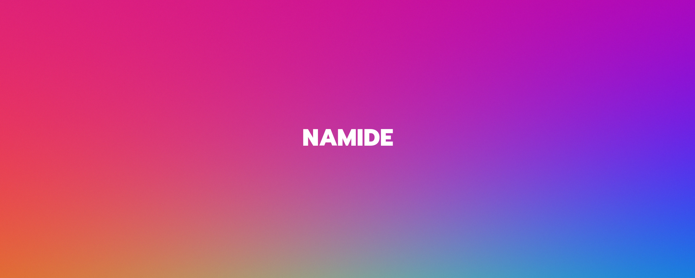

Hi, I'm [Namide](https://namide.com/), I like video games, books and programming 🦄

<!-- 
 -->

## Open source projects

**Extract Colors** - [site](https://extract-colors.namide.com/)  - [NPM](https://www.npmjs.com/package/extract-colors) - [GitHub](https://github.com/Namide/extract-colors)  
Extract color palettes from images (browser or Node.js)  
  

**Twon** _(in development)_ - [site](https://twon.namide.com/) - [NPM](https://www.npmjs.com/package/twon) - [GitHub](https://github.com/Namide/twon)  
Tween js/ts library with timeline and cubic bezier support

**AE tools** - [GitHub](https://github.com/Namide/AE-tools)  
Few helpers for After Effects

## 3D experiments

🃏 **Drag'n drop** - [demo](https://namide.github.io/havok-test/) - [GitHub](https://github.com/Namide/havok-test)  
Havok WASM web version with Three.js with drag'n drop support

🎮 **Platform** - [demo](https://namide.github.io/havok-test-2/) - [GitHub](https://github.com/Namide/havok-test-2)  
Havok WASM web version with Three.js for platform game with infinity terrain generation

👾 **Vailama** - [demo](https://vailama.namide.com/) - [GitHub](https://github.com/Namide/vailama)  
_Tiny SHMUP demo created for the [Three.js Journey Challenge #001](https://threejs-journey.com/) contest_

<!-- 🧊 **Aekino** - [sources](https://github.com/Namide/aekino)  
_WebGL render engine_

🧊 **MPGS** - [sources](https://github.com/Namide/mpgs)  
_Server/client for multiplayer mini games and chat_

## Helpers

**Share** - [sources](https://github.com/Namide/share)  
_Social networks share example_

**htaccess Gen** - [sources](https://github.com/Namide/htaccess-gen)  
_.htaccess and .htpassword generator_ -->

  
<!--

&message=<MESSAGE>&color=<COLOR>" align="right" />
brightgreengreenyellowgreenyelloworangeredbluelightgrey
successimportantcriticalinformationalinactive
bluevioletff69b49cf
-->

<!--
Here are some ideas to get you started: 👋

- 🔭 I’m currently working on ...
- 🌱 I’m currently learning ...
- 👯 I’m looking to collaborate on ...
- 🤔 I’m looking for help with ...
- 💬 Ask me about ...
- 📫 How to reach me: ...
- 😄 Pronouns: ...
- ⚡ Fun fact: ...
-->
